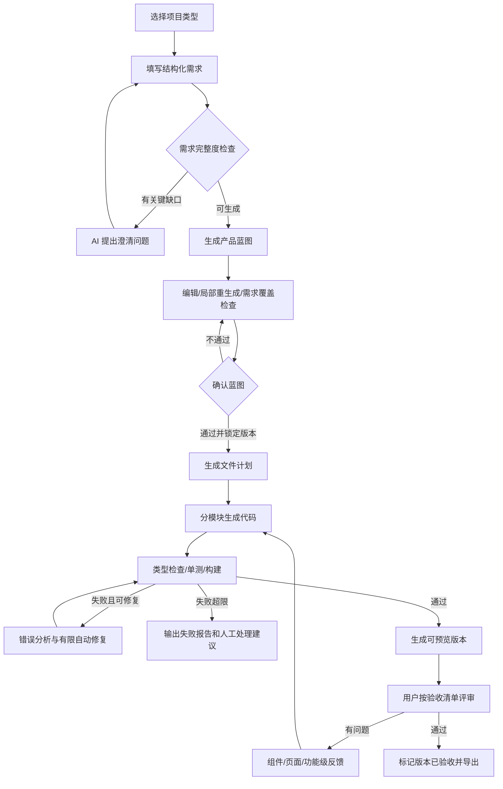

# AI 项目生成工作流优化方案

> 文档状态：待评审  
> 适用范围：项目创建、需求、蓝图、代码生成、构建验证、在线预览、文件版本与反馈闭环  
> 基准案例：中国象棋人机对战  
> 核心目标：将当前“固定落地页文案生成”升级为“面向不同应用类型的可验证应用生成”

## 1. 执行摘要

当前项目工作流已经具备“需求 → 蓝图 → 生成 → 预览”的页面和接口，但生成结果与用户要求存在结构性偏差。问题不主要来自模型能力，而来自现有生成架构：系统要求 AI 生成固定的营销落地页内容，并通过固定 `App.vue` 模板渲染 Hero、指标、案例、价格方案和联系表单。无论用户要求象棋游戏、管理后台还是工具应用，最终都会被压缩成宣传页面。

本方案将生成链路重构为：

```text
选择项目类型
  → 结构化需求与 AI 澄清
  → 可编辑、可验证的产品蓝图
  → 确认并锁定蓝图版本
  → 生成文件与模块计划
  → 分模块生成代码
  → 自动构建、测试与有限自动修复
  → 在线预览与验收清单
  → 针对性反馈、局部修改、版本对比与回滚
```

建议优先实施 P0：移除固定 Landing Page 生成器、引入项目类型、结构化需求、完整蓝图、确认版本约束和自动构建验证。仅优化界面或修改几句 Prompt，不能消除当前固定模板造成的根本限制。

---

## 2. 现状与根因

### 2.1 当前链路


### 2.2 已确认的根因

| 问题 | 当前实现证据 | 影响 |
|---|---|---|
| 需求信息不足 | `frontend/src/pages/ProjectRequirementsPage.vue` 只有目标、目标用户和核心功能三个字段 | 无法描述交互规则、状态、领域规则和验收标准 |
| 项目类型过于粗糙 | 创建页只有“生成新网站”和“分析已有项目” | 游戏、后台、工具等产品没有不同的生成策略 |
| 蓝图展示不完整 | 后端蓝图包含组件、API、数据模型等，前端只展示产品定位、技术栈和页面列表 | 用户无法真正评审生成依据 |
| 蓝图不可细粒度编辑 | 后端虽有保存接口，但蓝图页没有模块编辑、差异或局部重生成功能 | “确认蓝图”接近盲目确认 |
| 确认缺少质量门禁 | `Confirm` 只把最新蓝图状态更新为 `confirmed` | 不完整蓝图也能进入生成 |
| 生成没有使用已确认版本 | `loadLatestBlueprintContent` 读取最新蓝图，不筛选 `confirmed` | 实际生成输入可能不是用户确认的版本 |
| 固定生成落地页 | `backend/internal/service/ai_generation_service.go` 要求 metrics、features、cases、pricing、contact | 所有应用都被生成成营销页 |
| 固定代码渲染器 | `renderVueProjectFiles` 只生成固定的 `App.vue` | AI 只在填文案，没有生成真实功能模块 |
| 缺少生成版本 | 文件直接写入项目工作区 | 重新生成会覆盖文件，无法回滚或比较 |
| 缺少构建质量门禁 | 生成任务写完文件即标记成功，构建发生在预览阶段 | 无法编译的代码也会显示生成成功 |
| 缺少反馈闭环 | 预览页只能构建或重新构建 | 用户无法针对组件或问题局部修改 |
| 导航缺少流程语义 | 项目内所有 Tab 始终可访问，没有前置状态 | 用户不知道当前阶段、缺失项和下一步 |
| 任务取消不完整 | 取消只更新任务状态，没有终止后台生成上下文 | UI 状态与真实执行可能不一致 |

### 2.3 基准案例表现

“中国象棋人机对战”实际生成结果包含象棋相关营销文案、价格套餐和联系表单，但缺少：

- 棋盘与棋子；
- 初始局面；
- 合法走子规则；
- 回合状态；
- AI 落子；
- 将军、将死和胜负判断；
- 悔棋、重新开始和走棋记录。

该结果说明当前系统生成的是“介绍中国象棋产品的页面”，而不是“中国象棋应用”。

---

## 3. 优化目标与非目标

### 3.1 目标

1. 生成结果必须由需求和已确认蓝图驱动，而不是由固定营销模板驱动。
2. 系统必须区分互动应用、后台、内容站、电商、工具和落地页。
3. 用户能够在生成前发现需求缺口并修正蓝图。
4. 生成任务必须产出可运行代码，并通过基础构建与测试门禁。
5. 用户能够对预览问题进行局部修改，而不是每次全量重生成。
6. 每次生成都可追溯输入版本、模型、Prompt、文件差异和验证结果。
7. 工作区必须清晰表达阶段、完成状态、失败原因和推荐下一步。

### 3.2 非目标

- P0 不追求一次生成任意规模生产级系统。
- P0 不承诺自动完成复杂支付、生产部署和高风险安全功能。
- P0 不实现无限自动修复，单次生成最多自动修复两轮。
- P0 不允许模型无约束执行任意命令或访问工作区外路径。
- 不用全量自由生成替代确定性脚手架和代码验证。

---

## 4. 产品与交互设计原则

1. **先澄清，再生成**：影响架构和交互的问题必须在生成前确认。
2. **结构化优先**：自由文本作为补充，核心生成输入使用稳定数据结构。
3. **显式可追溯**：每个功能都能追溯到需求、蓝图、文件和测试。
4. **渐进式披露**：默认展示当前阶段关键信息，高级设置按需展开。
5. **确认即锁定**：生成必须绑定一个明确的已确认蓝图版本。
6. **确定性骨架，AI 填充功能**：脚手架、目录、构建配置由系统控制，业务模块由 AI 生成。
7. **验证后才成功**：写入文件不等于生成成功。
8. **局部迭代优先**：修复组件或功能时，不覆盖无关文件。
9. **失败可恢复**：保留版本、错误日志、差异和回滚能力。
10. **用户拥有最终控制权**：AI 建议可以编辑、拒绝、重生成或锁定。

---

## 5. 目标信息架构与导航

### 5.1 全局导航

将左侧“项目列表”调整为“项目”，表达这是项目域入口，而不是当前页面名称。进入某个项目后，左侧保持“项目”激活即可，不再与内部流程导航竞争。

### 5.2 项目工作区

项目工作区拆为“交付流程”和“项目资源”。

#### 交付流程

```text
需求 → 蓝图 → 生成 → 验证 → 预览
```

每一步显示以下状态之一：

- 未开始；
- 待完善；
- 可确认；
- 已确认；
- 进行中；
- 失败；
- 已完成；
- 已过期（上游输入已变化）。

后续步骤需要前置条件：

- 未保存有效需求时不能确认蓝图；
- 未确认蓝图时不能正式生成；
- 没有成功生成版本时不能验证；
- 构建失败时可以查看预览错误页，但不能标记交付完成。

#### 项目资源

- 文件；
- 版本；
- 报告；
- 导出；
- 设置。

### 5.3 项目概览重构

概览从“报告统计页”改成“项目控制台”，优先展示：

- 当前阶段和总体完成度；
- 需求完整度；
- 已确认蓝图版本；
- 最近生成版本；
- 构建、测试和预览状态；
- 未解决问题；
- 最近活动；
- 推荐下一步主操作。

质量趋势、工具使用和报告统计移入“报告”模块。

---

## 6. 目标功能流程



---

## 7. 详细功能设计

### 7.1 项目创建与类型识别

新增项目原型：

| 类型 | 适用场景 | 默认生成重点 |
|---|---|---|
| `interactive_app` | 游戏、画布、编辑器、交互工具 | 状态机、领域规则、交互反馈 |
| `dashboard` | 管理后台、运营系统 | 导航、列表、表单、权限、数据状态 |
| `data_product` | 数据看板、统计分析 | 指标、筛选、图表、加载与空状态 |
| `content_site` | 文档、资讯、博客、官网 | 信息架构、内容展示、搜索与 SEO |
| `ecommerce` | 商品、购物车、订单 | 商品流、购物车状态、结算流程 |
| `utility_app` | 计算器、转换器、效率工具 | 输入、处理逻辑、结果、历史记录 |
| `landing_page` | 活动页、营销页 | Hero、价值点、证明、转化动作 |

系统可根据描述推荐类型，但必须由用户确认。项目类型需要持久化到 Project 或 Requirement Spec，不能只存在于前端临时状态。

### 7.2 结构化需求

建议的 `RequirementSpecV2`：

```json
{
  "schema_version": 2,
  "app_type": "interactive_app",
  "goal": "提供可直接游玩的中国象棋人机对战",
  "target_users": ["休闲象棋玩家"],
  "primary_scenarios": [],
  "must_have_features": [],
  "should_have_features": [],
  "screens": [],
  "interaction_rules": [],
  "data_and_storage": {},
  "visual_preferences": {},
  "responsive_targets": ["desktop", "mobile"],
  "non_functional_requirements": [],
  "acceptance_criteria": [],
  "out_of_scope": [],
  "references": []
}
```

需求页分区：

1. 产品目标与目标用户；
2. 核心场景；
3. 必须实现与可选功能；
4. 页面/屏幕；
5. 交互和领域规则；
6. 数据、存储和接口；
7. 视觉与响应式；
8. 验收标准；
9. 排除项和限制。

AI 需求助手输出：

- 需求完整度评分；
- 关键缺口；
- 最多 3～5 个本轮澄清问题；
- 推断内容及置信度；
- 建议但非必须的功能。

严禁 AI 未经用户确认自行添加定价、会员、登录、支付或后端等重大范围。

### 7.3 可评审蓝图

建议的 `BlueprintSpecV2`：

```json
{
  "schema_version": 2,
  "app_type": "interactive_app",
  "product_goal": "...",
  "user_flows": [],
  "screens": [],
  "features": [],
  "interaction_rules": [],
  "component_tree": [],
  "state_model": [],
  "domain_rules": [],
  "api_endpoints": [],
  "data_models": [],
  "visual_system": {},
  "responsive_strategy": {},
  "acceptance_criteria": [],
  "test_plan": [],
  "implementation_notes": [],
  "open_questions": []
}
```

每个功能需要稳定 ID，并建立追踪关系：

```json
{
  "id": "F-003",
  "name": "合法走子",
  "priority": "must",
  "requirement_ids": ["R-004"],
  "acceptance_criteria": ["马按日字移动", "不能移动到己方棋子位置"]
}
```

蓝图页面能力：

- 完整查看全部模块；
- 表单化编辑；
- 单模块重新生成；
- 标记 AI 推断；
- 展示需求覆盖矩阵；
- 展示未决问题；
- 版本差异；
- 历史恢复；
- 确认并锁定版本。

确认门禁：

- 每项 Must Have 都已映射到蓝图功能；
- 每项核心功能至少有一个验收条件；
- 没有严重未决问题；
- 页面、组件和状态模型一致；
- 技术栈与项目类型兼容。

### 7.4 生成计划

代码生成前先产出 `GenerationPlan`，不直接生成文件：

```json
{
  "blueprint_version_id": "...",
  "template": "vue-interactive-app-v1",
  "files": [
    {
      "path": "src/components/ChessBoard.vue",
      "purpose": "棋盘和棋子交互",
      "feature_ids": ["F-001", "F-002"],
      "dependencies": ["src/game/rules.ts"]
    }
  ],
  "generation_batches": [],
  "verification_steps": []
}
```

计划生成后可以展示摘要，但不要求普通用户逐文件确认。高级模式允许调整文件范围、技术限制和禁止修改路径。

### 7.5 混合代码生成

采用“确定性脚手架 + AI 业务模块”的混合架构。

系统负责：

- `package.json` 和锁定的依赖版本；
- Vite、TypeScript、测试和格式化配置；
- 路由和入口；
- 目录边界；
- 构建与预览约定；
- 安全限制；
- 基础设计 Token；
- 测试运行脚本。

AI 负责：

- 页面和组件；
- 领域逻辑；
- 状态管理；
- 业务类型；
- 对应测试；
- 项目相关文案和视觉实现。

生成批次建议：

1. 类型、状态模型和领域逻辑；
2. 核心组件；
3. 页面组装和路由；
4. 样式与响应式；
5. 单元测试和 E2E 冒烟测试；
6. README、已知限制和交付说明。

禁止模型：

- 修改工作区外路径；
- 返回绝对路径或路径穿越；
- 添加需求外的支付、追踪脚本或外部密钥；
- 使用 `latest` 依赖版本；
- 无说明删除已锁定文件；
- 在局部修复中覆盖无关模块。

### 7.6 自动验证与修复

生成任务阶段：

| 阶段 | 主要动作 | 成功标准 |
|---|---|---|
| `prepare` | 创建版本工作区、加载锁定输入 | 输入版本完整 |
| `plan` | 生成文件计划和需求映射 | Must Have 全覆盖 |
| `scaffold` | 创建确定性工程骨架 | 配置完整 |
| `generate` | 分批生成模块 | 文件结构合法 |
| `static_check` | 路径、依赖、语法和敏感内容检查 | 无阻断项 |
| `typecheck` | TypeScript 类型检查 | 退出码 0 |
| `unit_test` | 核心逻辑单元测试 | 必测项通过 |
| `build` | Vite 生产构建 | 生成 `dist/index.html` |
| `smoke_test` | 页面加载和核心交互检查 | 无控制台阻断错误 |
| `repair` | 基于错误进行定向修复 | 最多两轮 |
| `publish` | 保存版本和预览地址 | 版本可访问 |

修复上下文只包含：

- 失败命令；
- 精简后的错误信息；
- 相关文件；
- 禁止修改范围；
- 原功能与验收条件。

如果两轮仍失败，任务必须标记失败，并输出可理解的失败报告，不能继续显示“生成成功”。

### 7.7 预览反馈闭环

预览页面增加反馈面板：

- 问题类型：功能缺失、交互错误、视觉偏差、文案、响应式、构建错误；
- 影响范围：组件、页面、功能、全局；
- 问题描述；
- 期望结果；
- 必须保留内容；
- 可选截图或标注；
- 建议修改文件预览；
- 文件差异；
- 接受修改或回滚。

将“重新生成”拆为：

- 修复当前问题；
- 重新生成当前组件；
- 重新生成当前页面；
- 基于新蓝图创建版本；
- 全量重新生成。

局部修复默认只允许修改计划声明的相关文件。修改后必须重新运行受影响测试和构建。

### 7.8 版本与回滚

每次生成创建不可变版本快照：

```text
workspace/<project-id>/versions/<generation-version-id>/
```

建议记录：

- Requirement 版本；
- Blueprint 版本；
- Generation Plan；
- 模型和 Prompt 版本；
- 生成文件清单和哈希；
- 构建日志；
- 测试结果；
- 自动修复历史；
- 用户反馈；
- 父版本 ID；
- 当前是否发布。

用户可对比版本、恢复版本和选择当前预览版本。工作目录可以是当前发布版本的可编辑副本，但版本快照不可原地覆盖。

---

## 8. 后端架构改造

建议将当前 `AIGenerationService` 拆分为以下职责：

```text
RequirementSpecService
  ├─ Validate
  ├─ AnalyzeCompleteness
  └─ GenerateClarificationQuestions

BlueprintService
  ├─ Generate
  ├─ Validate
  ├─ CompareVersions
  └─ ConfirmAndLock

GenerationPlanner
  ├─ SelectTemplate
  ├─ BuildFileManifest
  └─ BuildTraceabilityMap

CodeGenerationService
  ├─ Scaffold
  ├─ GenerateBatch
  └─ ApplyScopedPatch

VerificationService
  ├─ StaticCheck
  ├─ TypeCheck
  ├─ Test
  ├─ Build
  └─ SmokeTest

GenerationVersionService
  ├─ Snapshot
  ├─ Diff
  ├─ Publish
  └─ Rollback
```

### 8.1 Prompt 管理

蓝图、计划、代码批次、修复和验收应使用不同 Prompt 模板，不能继续把 Prompt 全部硬编码在服务里。

Prompt 模板应具备：

- 类型；
- 适用项目原型；
- 版本；
- 输入 JSON Schema；
- 输出 JSON Schema；
- 状态；
- 测试样例；
- 灰度配置；
- 创建人与发布时间。

后台 Prompt 管理必须真正连接服务端数据和运行时解析，不再使用前端硬编码示例列表。

### 8.2 任务取消

每个生成任务建立可取消 Context，并按 Task ID 保存 cancel function。取消时必须：

1. 更新任务状态；
2. 取消正在进行的 AI 请求或构建命令；
3. 停止后续文件写入和发布；
4. 保留临时日志；
5. 清理或标记未完成版本。

### 8.3 并发与隔离

- 同一项目默认只允许一个正式生成任务运行；
- 新任务启动前提示用户取消或等待已有任务；
- 生成、构建和修复使用受限工作目录；
- 限制文件数量、单文件大小、总大小和命令时间；
- 构建产物只从版本目录的 `dist/` 提供；
- 不允许 AI 直接决定系统命令。

---

## 9. 数据模型建议

### 9.1 Project

新增：

- `project_type`；
- `current_requirement_version_id`；
- `confirmed_blueprint_version_id`；
- `published_generation_version_id`；
- `workflow_status`。

### 9.2 RequirementVersion

- `id`；
- `project_id`；
- `schema_version`；
- `content_json`；
- `completeness_score`；
- `validation_result_json`；
- `created_by`；
- `created_at`。

### 9.3 BlueprintVersion

- `id`；
- `project_id`；
- `requirement_version_id`；
- `schema_version`；
- `content_json`；
- `status`：draft / generated / confirmed / superseded；
- `coverage_result_json`；
- `confirmed_at`；
- `created_at`。

### 9.4 GenerationVersion

- `id`；
- `project_id`；
- `parent_version_id`；
- `requirement_version_id`；
- `blueprint_version_id`；
- `generation_plan_json`；
- `status`；
- `workspace_path`；
- `verification_result_json`；
- `model_snapshot_json`；
- `prompt_versions_json`；
- `published_at`；
- `created_at`。

### 9.5 GenerationFeedback

- `id`；
- `project_id`；
- `generation_version_id`；
- `scope_type`；
- `scope_id`；
- `issue_type`；
- `description`；
- `expected_result`；
- `preserve_rules_json`；
- `attachments_json`；
- `status`；
- `result_version_id`。

---

## 10. API 建议

```text
GET    /api/projects/:id/workflow

GET    /api/projects/:id/requirements/latest
POST   /api/projects/:id/requirements/analyze
POST   /api/projects/:id/requirements/clarify
POST   /api/projects/:id/requirements/versions

POST   /api/projects/:id/blueprints/generate
GET    /api/projects/:id/blueprints/:versionId
PUT    /api/projects/:id/blueprints/:versionId
POST   /api/projects/:id/blueprints/:versionId/validate
POST   /api/projects/:id/blueprints/:versionId/confirm
POST   /api/projects/:id/blueprints/:versionId/regenerate-section

POST   /api/projects/:id/generation-plans
POST   /api/projects/:id/generations
GET    /api/projects/:id/generations/:versionId
GET    /api/projects/:id/generations/:versionId/stream
POST   /api/projects/:id/generations/:versionId/cancel
POST   /api/projects/:id/generations/:versionId/publish
POST   /api/projects/:id/generations/:versionId/rollback

GET    /api/projects/:id/generations/:versionId/diff/:targetVersionId
POST   /api/projects/:id/generations/:versionId/feedback
POST   /api/projects/:id/generations/:versionId/repair

GET    /api/projects/:id/preview/:versionId/*filepath
```

所有生成和修复接口必须保存输入版本快照，避免任务运行期间上游内容变化。

---

## 11. 前端页面改造

### 11.1 ProjectCreatePage

- 扩充项目类型；
- 展示类型的生成能力和限制；
- 支持 AI 推荐类型但由用户确认；
- 保存 `project_type`；
- 将技术栈改为推荐配置，高级模式再允许覆盖。

### 11.2 ProjectRequirementsPage

- 使用分组表单和可重复条目；
- 自动保存草稿；
- 离开前未保存提示；
- 需求完整度侧栏；
- AI 澄清问题卡片；
- 明确 AI 推断与用户输入；
- 保存成功反馈；
- 提交生成蓝图前执行验证。

### 11.3 BlueprintPage

- 显示完整 Blueprint Spec；
- 需求覆盖矩阵；
- 分区编辑和局部重生成；
- 未决问题；
- 版本历史和差异；
- 确认门禁；
- 确认后只读，需要修改时创建新草稿版本。

### 11.4 GenerationPage

- 显示绑定的需求和蓝图版本；
- 显示真实生成阶段；
- 将日志分为用户摘要和技术详情；
- 显示文件计划与需求覆盖；
- 取消操作真实中止任务；
- 构建失败时提供错误摘要和修复状态；
- 生成成功后展示测试和构建报告。

### 11.5 PreviewPage

- 支持选择生成版本；
- 预览与反馈面板并列；
- 提交组件/页面/功能级问题；
- 显示验收清单；
- 显示当前版本构建状态；
- 查看修改差异；
- 接受、回滚或继续修改。

### 11.6 ProjectWorkspaceLayout

- 主流程改为带状态的 Stepper；
- 资源功能与流程分组；
- 未满足前置条件的步骤禁用并解释原因；
- 响应式下使用可横向滚动 Stepper 或下拉步骤菜单；
- 主操作固定为当前阶段的推荐下一步。

---

## 12. 中国象棋基准蓝图

### 12.1 必须实现

- 正确的中国象棋初始布局；
- 红黑双方棋子显示；
- 选择棋子和目标位置；
- 基础合法走子；
- 轮流走棋；
- AI 产生合法响应；
- 当前回合提示；
- 重新开始；
- 走棋记录；
- 胜负或基础结束状态；
- 桌面端和移动端可用。

### 12.2 建议实现

- 悔棋；
- AI 难度；
- 将军提示；
- 本地保存；
- 音效开关；
- 棋盘主题。

### 12.3 合理文件结构

```text
src/
├─ components/
│  ├─ ChessBoard.vue
│  ├─ ChessPiece.vue
│  ├─ GameControls.vue
│  └─ MoveHistory.vue
├─ game/
│  ├─ types.ts
│  ├─ initialBoard.ts
│  ├─ rules.ts
│  ├─ legalMoves.ts
│  └─ ai.ts
├─ stores/
│  └─ gameStore.ts
├─ views/
│  └─ GameView.vue
├─ tests/
│  ├─ rules.test.ts
│  └─ game-flow.spec.ts
└─ App.vue
```

### 12.4 明确禁止的默认内容

除非用户需求明确提出，否则不生成：

- Pricing；
- Customer Proof；
- 联系销售表单；
- 虚构用户数量和棋谱数量；
- 会员套餐；
- 企业客户案例；
- 与游戏无关的营销模块。

---

## 13. 分期实施方案

### P0：修正生成方向

目标：从固定落地页升级为能生成不同应用类型的可运行 MVP。

- [ ] Project 增加 `project_type`；
- [ ] 创建页支持多项目原型；
- [ ] 实现 `RequirementSpecV2`；
- [ ] 实现需求完整度和澄清问题；
- [ ] 实现 `BlueprintSpecV2`；
- [ ] 蓝图页面完整展示和编辑；
- [ ] 蓝图确认门禁和版本锁定；
- [ ] 生成只读取已确认蓝图版本；
- [ ] 删除固定 `CodeGenerationContentSpec`；
- [ ] 删除固定 Landing Page `renderVueProjectFiles`；
- [ ] 建立至少三类模板：interactive_app、dashboard、landing_page；
- [ ] 实现 Generation Plan；
- [ ] 分模块生成代码；
- [ ] 生成任务中执行 typecheck、test、build；
- [ ] 构建失败最多自动修复两轮；
- [ ] 生成结果绑定版本和验证报告；
- [ ] 使用象棋案例作为阻断性验收用例。

### P1：形成反馈闭环

- [ ] 生成版本快照；
- [ ] 版本差异和回滚；
- [ ] 预览反馈面板；
- [ ] 组件/页面/功能级局部修复；
- [ ] 需求—蓝图—文件—测试追踪；
- [ ] 工作区状态 Stepper；
- [ ] 项目概览重构；
- [ ] 任务真实取消；
- [ ] 同项目生成并发控制；
- [ ] Prompt 模板运行时接入管理后台。

### P2：质量和扩展能力

- [ ] 上传参考截图和设计参考；
- [ ] 自动生成并持久化设计系统；
- [ ] 增加 ecommerce、content_site、data_product、utility_app 模板；
- [ ] 复杂多页面生成；
- [ ] 可复用领域模板；
- [ ] Prompt 灰度、评测集和回归比较；
- [ ] 生成质量评分和历史趋势；
- [ ] 用户反馈驱动的模板改进分析。

---

## 14. 测试策略

### 14.1 单元测试

- Requirement 和 Blueprint Schema 校验；
- 需求完整度计算；
- 蓝图需求覆盖；
- 已确认版本选择；
- 文件计划路径安全；
- 局部修改范围控制；
- 任务状态机和取消；
- 版本快照和回滚。

### 14.2 集成测试

- 需求版本到蓝图版本；
- 蓝图确认到 Generation Plan；
- 生成文件到验证报告；
- 构建失败到自动修复；
- 发布版本到预览路由；
- 用户反馈到局部修复版本。

### 14.3 E2E 测试

至少覆盖：

1. 创建互动应用项目；
2. 填写结构化象棋需求；
3. 生成并编辑蓝图；
4. 未通过门禁时禁止确认；
5. 确认蓝图并生成；
6. 构建和测试通过；
7. 预览出现可交互棋盘；
8. 提交局部反馈；
9. 查看差异并接受修改；
10. 回滚到上一版本。

### 14.4 AI 回归评测集

建立固定用例：

- 中国象棋互动游戏；
- Todo 工具；
- CRM 管理后台；
- 销售数据看板；
- 企业营销落地页；
- 内容博客。

评测维度：

- 应用类型识别；
- Must Have 覆盖；
- 需求外内容比例；
- 构建通过率；
- 测试通过率；
- 核心交互可用率；
- 自动修复成功率；
- 用户首次验收通过率。

---

## 15. 成功指标

建议上线后持续统计：

| 指标 | 定义 |
|---|---|
| 首次构建通过率 | 首轮生成无需修复即可构建成功的任务占比 |
| 最终构建通过率 | 自动修复后构建成功的任务占比 |
| Must Have 覆盖率 | 已实现并验证的必须功能数 / 必须功能总数 |
| 需求外内容率 | 未经需求或蓝图授权生成的重大功能比例 |
| 首次预览可用率 | 用户首次打开预览即可完成核心操作的项目占比 |
| 局部修改成功率 | 无需全量重生成即可解决反馈的比例 |
| 平均修复轮次 | 从首次生成到通过门禁的平均修复次数 |
| 回滚率 | 因生成质量问题回滚的版本比例 |
| 蓝图修改率 | 用户生成后主动修改蓝图的项目比例，用于发现蓝图质量问题 |

P0 验收不应只看“接口成功”，必须同时看应用类型匹配、需求覆盖和可运行性。

---

## 16. 风险与控制

| 风险 | 控制方案 |
|---|---|
| 自由生成导致不可控代码 | 使用确定性脚手架、Schema、路径限制和命令白名单 |
| AI 一次生成上下文过大 | 先计划后分批生成，只携带相关文件 |
| 自动修复破坏已正确功能 | 限定修改范围、保存父版本、执行回归测试 |
| 生成时间明显增加 | 阶段进度、缓存依赖、并行独立验证、支持取消 |
| 模型输出 JSON 不稳定 | 结构化输出、Schema 校验、有限重试 |
| 用户需求过于宽泛 | 完整度检查和关键澄清问题 |
| 用户误确认不完整蓝图 | 确认门禁和未决问题阻断 |
| 版本存储增长 | 压缩快照、文件去重、保留策略 |
| AI 生成恶意依赖或脚本 | 依赖允许列表、锁定版本、沙箱构建 |
| 旧项目数据无法使用 | Schema 版本化和只读兼容适配 |

---

## 17. 兼容与迁移

1. 现有 Requirement 视为 `schema_version: 1`，读取时映射到 V2 的基础字段。
2. 现有 Blueprint 保留只读展示，重新编辑时升级生成 V2 草稿。
3. 现有工作区标记为 Legacy Generation，不强行推断验证结果。
4. 用户首次使用新流程时选择项目类型并确认迁移后的结构化需求。
5. 旧预览仍可访问，但新生成必须绑定 Generation Version。
6. 不删除旧文件和旧蓝图，直到用户明确清理。

---

## 18. P0 完成定义

P0 只有同时满足以下条件才算完成：

- [ ] 项目类型已经持久化并影响生成策略；
- [ ] 需求使用 V2 结构并有完整度校验；
- [ ] 蓝图完整可编辑，并能执行需求覆盖检查；
- [ ] 生成任务只能使用明确的已确认蓝图版本；
- [ ] 固定 Landing Page 内容模型和渲染器已移除；
- [ ] 至少三种项目模板可运行；
- [ ] 生成计划能追踪功能到文件；
- [ ] 生成后自动执行 typecheck、test 和 build；
- [ ] 失败任务不会显示成功；
- [ ] 中国象棋案例生成可交互棋盘和基础人机对战；
- [ ] 象棋案例默认不包含价格、客户案例和销售联系表单；
- [ ] 相关后端单测、前端单测和 E2E 测试全部通过；
- [ ] 旧项目可以继续查看和导出。

---

## 19. 建议实施顺序

1. 先定义并评审 RequirementSpecV2、BlueprintSpecV2 和 GenerationVersion 数据结构。
2. 完成项目类型、结构化需求和蓝图确认门禁。
3. 将生成逻辑从 `AIGenerationService` 中拆分，移除固定落地页渲染器。
4. 建立 interactive_app、dashboard 和 landing_page 三类脚手架。
5. 实现 Generation Plan 和分模块生成。
6. 将 typecheck、test、build 和自动修复纳入任务状态机。
7. 使用中国象棋案例完成第一轮端到端验收。
8. 再实施版本、差异、回滚和预览反馈闭环。
9. 最后扩展项目类型、设计参考和 AI 评测体系。

该顺序优先消除“生成方向错误”，再优化可恢复性和高级体验，避免在固定落地页架构上继续叠加界面功能。
